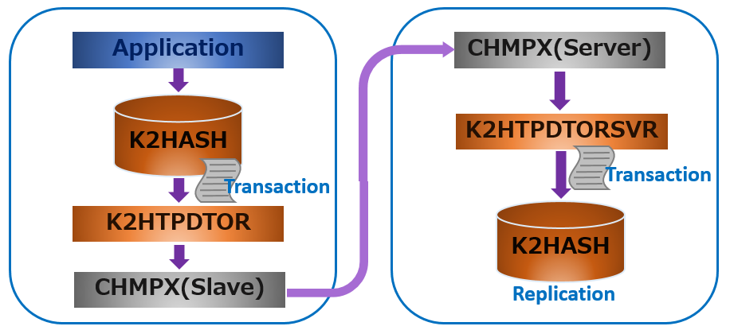

# K2HTPDTOR
**K2HTPDTOR** ([**K2H**ash](https://k2hash.antpick.ax/indexja.html) **T**ransaction **P**lugin **D**istributed **T**ransaction **O**f **R**epeater) は、[K2HASH](https://k2hash.antpick.ax/indexja.html) 操作のトランザクションを [CHMPX](https://chmpx.antpick.ax/indexja.html) を利用して他ホストへ転送を行い、[K2HASH](https://k2hash.antpick.ax/indexja.html) データの複製を容易に実現することを主目的としたプログラムです。

[K2HASH](https://k2hash.antpick.ax/indexja.html) ライブラリで提供されるトランザクションプラグインに対応した標準トランザクションプラグインで、[K2HASH](https://k2hash.antpick.ax/indexja.html) ファイル（メモリ）に対するトランザクションを受け取り、独自の処理を行うための一般的な手段を提供します。  
この手段の提供により、トランザクションをトリガとしたあらゆる処理が可能です。

## 概要説明
以下の例は、[K2HASH](https://k2hash.antpick.ax/indexja.html) データの操作のトランザクションを [CHMPX](https://chmpx.antpick.ax/indexja.html) を利用して、他ホストに転送し、[K2HASH](https://k2hash.antpick.ax/indexja.html) データの複製を作成するモデルです。

上記の図のトランザクションの転送の流れを説明します。

1. アプリケーションが **K2HASH** データを操作します。
2. **K2HASH** ライブラリにより **K2HASH** データの操作をトランザクションのデータとして **K2HTPDTOR** に引き渡されます。
3. **K2HTPDTOR** は、**CHMPX** プログラム（スレーブノード）を使い、**CHMPX** プログラム（サーバーノード）にトランザクションデータを送ります。
4. **CHMPX** プログラム（サーバーノード）がトランザクションデータを受け取り、そのデータを **K2HTPDTORSVR** に引き渡します。
5. **K2HTPDTORSVR** により **K2HASH** にトランザクションデータの示す操作が行われ、 **K2HASH** の複写ができます。

この例では、**K2HTPDTORSVR** プログラム（**K2HTPDTOR** と一緒に公開されている受信専用プログラム）を利用して、**K2HASH** データの複製を行っています。

**K2HTPDTOR**プログラム（シェアードライブラリ）は、設定によりトランザクションのフィルタリングができ、またトランザクションから**K2HASH**データのアーカイブデータを出力できます。  
**K2HTPDTORSVR**プログラムも、設定により、トランザクションから**K2HASH**データのアーカイブデータを出力、指定した外部プログラムを起動してトランザクションデータを引き渡したり、**CHMPX**を利用して再転送したりできます。

トランザクションデータの転送には、**CHMPX**を利用していますので、転送の際に多重化、ブロードキャスト、選択的な転送なども**CHMPX**の設定でできます。
