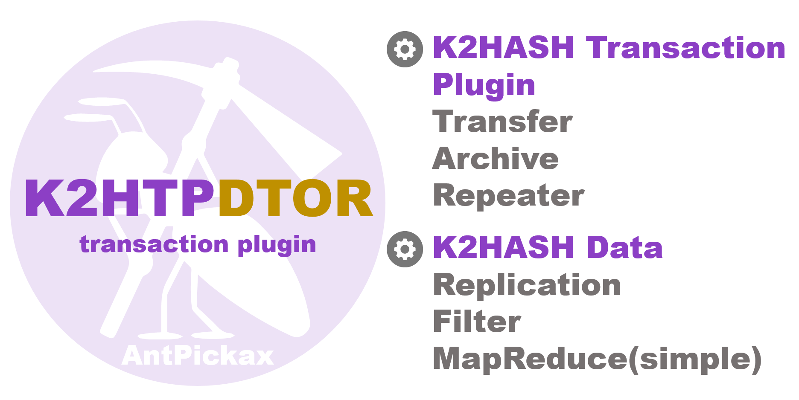

# **K2HTPDTOR**
**K2HTPDTOR** ([**K2H**ash](https://k2hash.antpick.ax/indexja.html) **T**ransaction **P**lugin **D**istributed **T**ransaction **O**f **R**epeater) は、[K2HASH](https://k2hash.antpick.ax/indexja.html) 操作のトランザクションを [CHMPX](https://chmpx.antpick.ax/indexja.html) を利用して他ホストへ転送を行い、[K2HASH](https://k2hash.antpick.ax/indexja.html) データの複製を容易に実現することを主目的としたプログラムです。
**K2HTPDTOR** は、Yahoo! JAPANがオープンソースとして公開するプロダクト [AntPickax](https://antpick.ax/indexja.html) のひとつです。  

## {{ page.arrow_link_overview }}
**K2HTPDTOR** の[概要](homeja.html)について説明します。  

## {{ page.arrow_link_details }}
**K2HTPDTOR** の[詳細](detailsja.html)について詳しく説明します。  

## {{ page.arrow_link_usage }}
**K2HTPDTOR** をプログラムから[使う方法](usageja.html)について説明します。  

## {{ page.arrow_link_build }}
**K2HTPDTOR** をGithubの[ソースコード]({{ site.github.repository_url }})から[ビルド](buildja.html)する方法を説明します。

# **AntPickaxについて**
[AntPickax](https://antpick.ax/indexja.html)は、Yahoo! JAPANがオープンソースとして公開する一連のプロダクト群です。  
詳細は、[AntPickax](https://antpick.ax/indexja.html) を参照してください。
